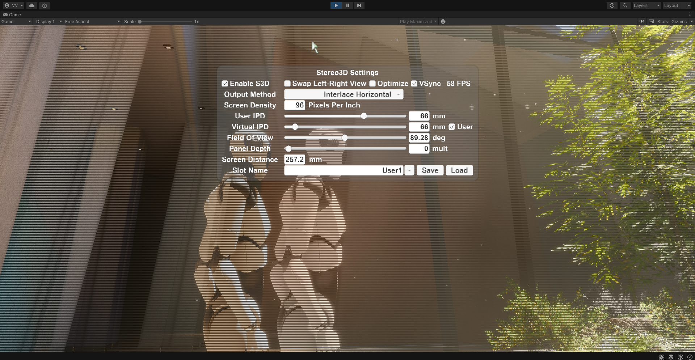

# Stereoscopic 3D system for Unity 2019 and above, URP, and HDRP

I spent thousands of hours in virtual reality using the horizontal interleaved Stereo3D method with my Zalman polarized glasses and LG D2342P monitor, sometimes more than 12 hours per day without any problems with eyes. Stereo 3D even more healthy for the eyes as they not holding constant geometry focus on the screen plane like with mono image - in S3D eyes geometry focus dynamically changes in the full depth range dependent where you looking at from before a screen objects to infinity far behind a screen on distant objects, same as watching through a window to outdoor distant mountains or Starsky in a reality where eyes relaxing being on parallel axes. :sunglasses:

I love Stereoscopic 3D and don't want to see a mono image of the 3D world anymore, but using drivers like iZ3D, Tridef, Nvidia 3D Vision, etc was always a pain.
All of them have incorrect approaches in settings like Separation/Convergence which are valid only for fixed FOV(Field Of View), when FOV is changed then settings are ruined.
Also there are always problems with the not correct depth of shadows, post-process effects, etc, bad profiles for games. I also made fixes and profiles for games in the past.

I am good at understanding how Stereoscopic 3D works and made the correct system for Unity.  
Now I am using precision Stereo3D in my projects and enjoying it like never before.  

Move the `Stereo3D` folder to the Unity `Assets` folder or import `Stereo3D.unitypackage`.  
Just add C# script to any camera and go.  
Tested on Unity 2019 and 2020 with default render + Post Processing Stack v2, URP, and HDRP.  
More info in the script file.  

Default shortcut Keys: 
    Numpad `0` Show/Hide S3D settings panel. 
    Numpad `.` On/Off Stereo3D
    `Left Ctrl + Numpad `.` save S3D settings to `slot Name`.
    Hold Numpad `.` for 1 second to load S3D settings from `slot Name`.
    `Left Shift + Numpad `.` swap left-right cameras.
    Numpad `+`,`-` FOV tune.
    `Left Ctrl` + Numpad `+`,`-` Virtual IPD tune if unlocked from `User IPD`(`Match User IPD` unchecked).
    Hold `Left Shift` for a faster tune.

When launch, Monitor's Pixels Per Inch(PPI) should be autodetected and precision screen width will be calculated internally and settings should be in real millimeters, so you don't need to set `PPI` or `Pixel Pitch` manually if the `PPI` of your screen autodetected correctly. Sure, also Save/Load user settings should be implemented with a Unity project.  
Set `User IPD` to your own interpupillary distance(IPD) for a realistic view with infinity S3D depth.  
Uncheck `Match user IPD` and set `Virtual IPD`(Cameras IPD in the virtual world) larger than your own IPD for toy world effect and vice versa.  
`Screen Distance` will show how far from the screen your eyes should be(camera's point) where Real and Virtual FOV will match and you get a 100% realistic view. (Very important for Vehicle Simulators).

## License

This software is licensed under the terms of the [MIT](LICENSE).

The license file was added at revision [5b41b7f](https://github.com/Vital-Volkov/Stereoscopic-3D-system-for-Unity-2019-/commit/5b41b7f) on 2025-02-04, but you may consider that the license applies to all prior revisions as well.

## Donate

Bitcoin `bc1qf0af260q970f3ryrmlcde62jk4h6zhj08rkkjz`  
Litecoin `LVHktaDKWkyK96H2vcmvNWYx2nMkcysA2J`  
Or ask me and I will give you the required donate option.
